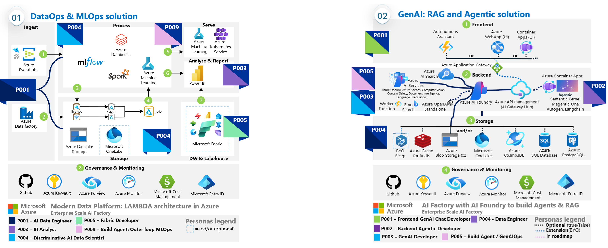
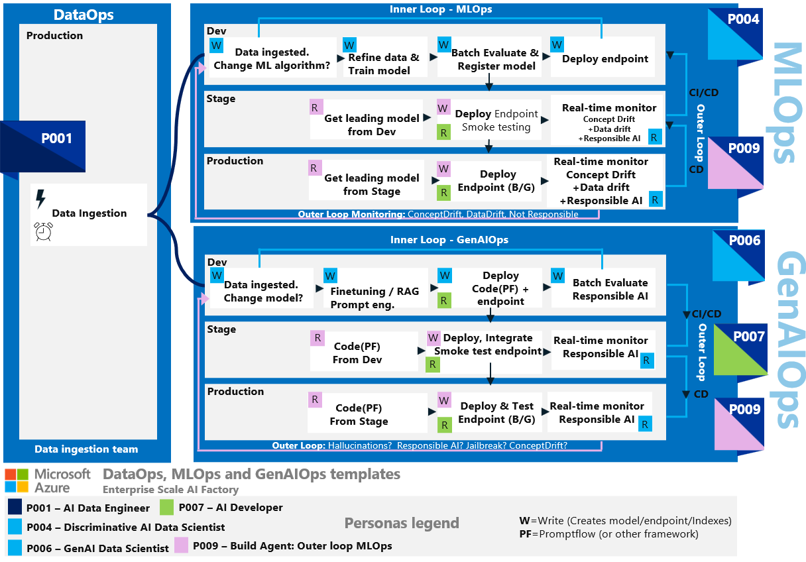
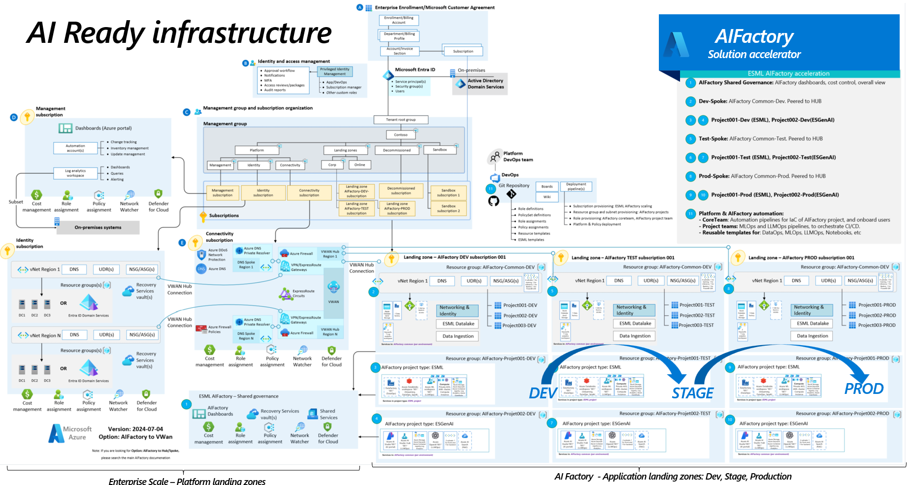

# Enterprise Scale AI Factory - Template repo


Welcome to the official *Enterprise Scale AIFactory* solution accelerator template. <br>
This is a template repository, bootstrapped with the *Enterprise Scale AIFactory submodule* (the most common way of leveraging the AIFactory template acceleration)<br>

This is a enteprise scale solution for deploying AI Foundry with related services to create End-2-End agentic scenarios, into multiple isolated environments (Dev,Stage,Prod) with private networking in Azure. You may optionally add/remove services such as Azure Machine learning, Bing or other services. The deployed features follow [Microsoft's Well-Architected Framework](https://learn.microsoft.com/en-us/azure/well-architected/ai/personas) to establish an isolated infrastructure intended to assist in moving from a Proof of Concept state to a production-ready application. It also includes templates for DataOps, MLOps and GenAIOps, compatible with the secure infra setup.

This repo will leverages resources/templates from the [`Enterprise Scale AI Factory submodule`](https://github.com/jostrm/azure-enterprise-scale-ml/) including templats for `IaC AI landingzones, DataOps, MLOps, 
GenAIOps`.

The mirror repo based on this repo, will act as your repo with options as: [Github private, internal, public repo](https://resources.github.com/learn/pathways/administration-governance/essentials/manage-your-repository-visibility-rules-and-settings/), or a [private or public Azure Devops repository](https://learn.microsoft.com/en-us/azure/devops/organizations/projects/make-project-public?view=azure-devops)

>[!NOTE]
>Since the mirror repo will become your repo (or see BYORepo option), you will not have any failure with tokens/cross-authentication.
>

> [!NOTE]
> Since *Well-architected Framework* does not recommend using the Azure Developer CLI (`AZD`) for production purposes (or other dev/preview technology such as Azure Verified Module(`AVM`), we removed those, to only use GA `Azure CLI` with orchestrator pipelines in `Github Actions`or `Azure Devops pipelines`.
> Also both a Managed Identity and Service principal is created for your team, to be able to automate the full **GenAIOps process** (via the GenAIOps template)

The *AI Factory project* of type *GenAI* has a baseline or the services: **AI Foundry, AI Services, AI Search** + 2 Storage accounts, Keyvault, Monitoring, Dashboards, Private networking - optionally hybrid mode with public user access. <br>
Via *AI Factory feature flags* you can add optional services, re-run the Github action workflow (or Azure Devops pipeline) - to incrementally build your solution (e.g start without front-end in PoC). 

The services that can be added on top of the **BASELINE** can be seen in the image below: 
- **AI related**: Azure OpenAI (standalone), Azure Machine Learning, Bing Grounding, AI Search (on/off), Azure Speech, Azure Vision
- **Front end/Backend hosting**: Azure ContainerApps, Azure Webapp/function, AKS
- **Data & Databases**: Azure Cosmos DB, MongoDB, Azure SQL Database, PostgreSQL Flexible server, Azure cache for Redis
- **Integration & ELT/ETL/Streaming**: Azure Datafactory, Databricks, EventHubs, APIM - AI Gateway Hub(integration & IaC), Microsoft Onelake (integration: Snowflake, S3, etc)



[How-to SETUP AI Factory](./documentation/bootstrapping.md)<br>
[How-to UPDATE AI Factory](https://github.com/jostrm/azure-enterprise-scale-ml/blob/main/documentation/v2/20-29/26-update-AIFactory.md)<br>
<details>
  <summary><b>The purpose of this repo</b></summary>

## The purpose of this repo
This repo, is purposed to bootstrap a repository, that automatically links to the centralized (readonly)submodule `azure-enterprise-scale-ml`, and provides you with templates for YOUR variables, to customize your AI Factory, besides the basic [.env.template](./.env.template) parameters that will end up as Variables in your Github/Azure Devops.

It also provides an automation script to copy templates IaC automation variables and other templates for [DataOps, MLOps, GenAIOps - Read more](https://github.com/jostrm/azure-enterprise-scale-ml/).<br>

## Simple mode VS Advanced mode
This repo is the *simple mode* to setup an AIFactory. This contains automation to:
- Automate the [full manual AIFactory setup process seen here](https://github.com/jostrm/azure-enterprise-scale-ml/blob/main/documentation/v2/10-19/13-setup-aifactory.md). Estimated time effort for manual setup is 10min with this repo.
- Using default vaules for all ~30 [AIFactory based parameters seen here](https://github.com/jostrm/azure-enterprise-scale-ml/blob/main/documentation/v2/10-19/13-parameters-ado.md), saving you estimated time effort of 1h.
- Making it a good choice to quickly setup infrastructure securely for 
        - AI-hackathons, workshops, education, scenarios where you are OK if naming convention does not comply 100% with your organizations choices, and you don't need to peer it to your Hub - e.g. where `AIFAcotry standalone mode` is OK.
        - Or configre all paramaters "advanced mode" to get an: Enterprise grade platofrm with Dev, Stage, Prod enviroments.

> [!NOTE]
> You can still go into *advanced mode*, and edit all parameters. You will find them here in the [aifactory/parameters](./aifactory/parameters) folder.
>

</details>

> [!IMPORTANT]
>This repo provides a ready-to-run github repo, bootstrapped and connected to the *Enterprise Scale AI Factory Github submodule*. For full documentation visit the documentation section [`Enterprise Scale AI Factory submodule`](https://github.com/jostrm/azure-enterprise-scale-ml/blob/main/documentation/readme.md)
>

## Setup options - Github & Azure Devops as orchestrators
Setup as a mirror-repo (Github) or "Bring your own repo" (Github or Azure Devops).

<details>
  <summary><b>Github - Mirror repo</b></summary>

Bootstrap as a mirror-repo in Github, it becomes a private, internal or public Github repo
- **When to choose**: If you are allowed to create own repos, and Gihub is your preffered choice.
- **Automation scripts to run**:  [Bootstrapping a new AIFactory](documentation/bootstrapping.md), or do quickstart: 
- **Quickstart:**
    - 1) [01a-GH-mirror-repo-from-template-once.sh](./01a-GH-mirror-repo-from-template-once.sh)
    - 2) VS code open up a new Window with your new repo - Rename `.env.template` to `.env` and edit it. 
        - Edit the PARAMETER folder also. 
    - 3) Go to Github.com to your repo, and edit the secret: `AZURE_CREDENTIALS` - it should be formatted as follows:
            ```json
            {
                "clientId": "your-client-id-aka-appId",
                "clientSecret": "your-client-secret-aka-servicPrincipalSecret",
                "subscriptionId": "your-subscription-id",
                "tenantId": "your-tenant-id"
            }
            ```
    - 4) Run at least 2 Github Actions workflows at Github.com | or: [04ab-setup-infra-aifactory.sh](./04ab-setup-infra-aifactory.sh)
        - infra-common.yaml
        - infra-project-genai.yaml

</details>
<details>
  <summary><b>Github/Axure Deveop - Bring your own repo</b></summary>

- **When to choose**: If your organization don't allow you to create repos, or if you preffer Azure Devops.
- **Automation scripts to run**: See full instructions here:  [Bootstrapping a new AIFactory](documentation/bootstrapping.md)

## Setup options - Azure Devops
As of now, only the `advanced mode` is possible, and `.yaml`:
Please visit the full documentation for here. [Enterprise Scale AI Factory - Setup](https://github.com/jostrm/azure-enterprise-scale-ml/blob/main/documentation/v2/20-29/24-end-2-end-setup.md)

> [!NOTE]
>   
> The setup will create pipelines in Azure Devops or Github (as GHA workflowws), and the pipelines will setup the AIFactory and AI Factory projects. Before you start you will need configure your [.env](./.env) environment variables. Read more at [bootstrapping.md](./documentation/bootstrapping.md) section.
>

</details>

For full documentation, please visit [`Enterprise Scale AI Factory documentation`](https://github.com/jostrm/azure-enterprise-scale-ml/blob/main/documentation/readme.md)

## Feature Highlights

- Bootstrap your project in under an hour, including enterprise grade security
- Enterprise grade security and networking (private / WAF).
- Provision resources with IaC (BICEP)
- Automate IaC with (Github Actions or Azure Devops)
- Easy-to-configure and extend templates: DataOps, MLOps, GenAIOps
- Aligned with Well-Architected Framework and Cloud Adoption Framework
- AI Factory project types:
    - **GenAI**: GenAI: Azure AI Foundry with RAG using Azure AI Search
    - **ESML**: DataOps and MLOps with notebooks templates - both Databricks (Pyspark) and Jupyter notebooks(Python). Mix compute & tech, while using same MLOps pipeline

### Project Types (IaC templates) - Well-architected Framework


### DataOps, MLOps, GenAIOps (templates) - Well-architected Framework
[Read more: Well-Architected Framework AI workload](aka.ms/wafai)



### Enterprise Scale: AI Ready landingzones - Cloud Adoption Framework
[Read more: AI Factory in CAF](https://learn.microsoft.com/en-us/azure/cloud-adoption-framework/ready/azure-best-practices/ai-machine-learning-mlops?source=docs)



> [!NOTE]
>**Enterprise security**: Both fully private mode (private link for also the Azure AI Studio) or private link with AI Studio accessible from certain IP. Role-based access control is used, meaning EntraID for all sercice-to-servcice and user-to-service connections. Not using any keys (since global keys have full permission to services, it is not recommended)
>

[Full documentation -  "Enterprise Scale AI Factory"](https://github.com/jostrm/azure-enterprise-scale-ml/blob/main/documentation/readme.md)

## Contributing

This project welcomes contributions and suggestions.  Most contributions require you to agree to a
Contributor License Agreement (CLA) declaring that you have the right to, and actually do, grant us
the rights to use your contribution. For details, visit https://cla.opensource.microsoft.com.

When you submit a pull request, a CLA bot will automatically determine whether you need to provide
a CLA and decorate the PR appropriately (e.g., status check, comment). Simply follow the instructions
provided by the bot. You will only need to do this once across all repos using our CLA.

This project has adopted the [Microsoft Open Source Code of Conduct](https://opensource.microsoft.com/codeofconduct/).
For more information see the [Code of Conduct FAQ](https://opensource.microsoft.com/codeofconduct/faq/) or
contact [opencode@microsoft.com](mailto:opencode@microsoft.com) with any additional questions or comments.

## Trademarks

This project may contain trademarks or logos for projects, products, or services. Authorized use of Microsoft 
trademarks or logos is subject to and must follow 
[Microsoft's Trademark & Brand Guidelines](https://www.microsoft.com/en-us/legal/intellectualproperty/trademarks/usage/general).
Use of Microsoft trademarks or logos in modified versions of this project must not cause confusion or imply Microsoft sponsorship.
Any use of third-party trademarks or logos are subject to those third-party's policies.
