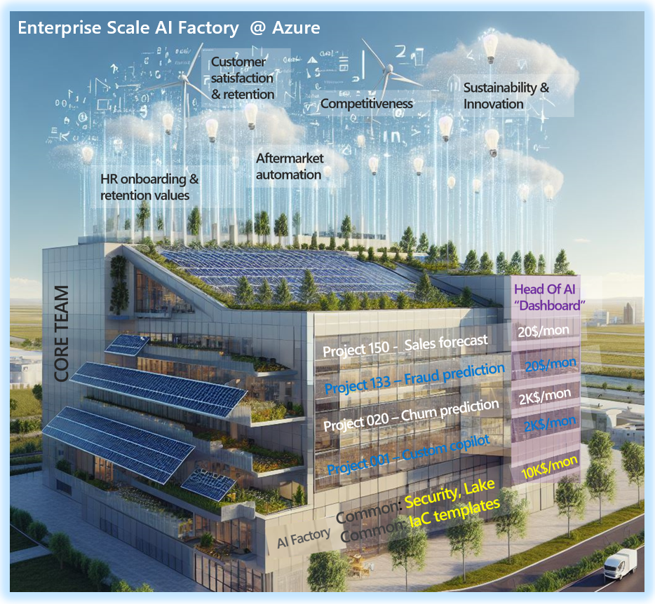
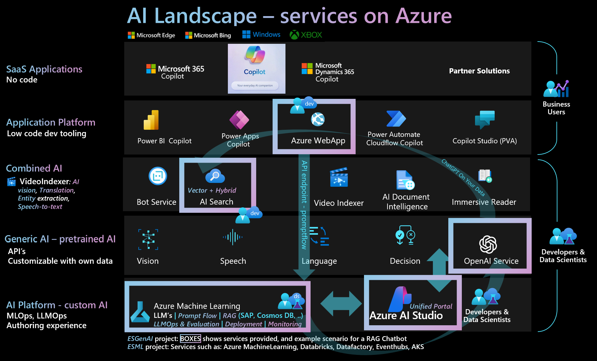

# Project

The `Enterprise Scale AI Factory` is a plug and play solution that automates the provisioning, deployment, and management of AI projects on Azure with a template way of working.
- Plug and play accelerator for: DataOps, MLOps, LLMOps, enteprise scale environments.

It is based on the earlier `Enterpries Scale ML (ESML) AI Factory` open source project: https://github.com/jostrm/azure-enterprise-scale-ml

## Main purpose: 
1) `Marry mutliple best practices & accelerators:` It reuses multiple existing Microsoft accelerators/landingzone architecture and best practices such as CAF & WAF, and provides an end-2-end experience including Dev,Test, Prod environments.
2) `Plug-and-play`: Dynamicallly create infra-resources per team, including networking dynamically, and RBAC dynamically
    - Example of dynamicall: Subnet/IP calculator, ACL permission on the datalake for a project team, services "glued together"
4) `Template way of working & Project way of working:` The AI Factory is `project based` (cost control, privacy, scalability per project) and provides <b>multiple templates</b> besides infrastructure template: `DataLake template, DataOps templates, MLOps templates`, with selectable project types.
    - Sub-purpose: `Same MLOps` - weather data scientists chooses to work from Azure Databricks or Azure Machine Learning` - same MLOps template is used.
    - Sub-purpose: `Common way of working, common toolbox, a flexible one`: A toolbox with a LAMBDA architecture with tools such as: Azure Datafactory, Azure Databricks, Azure Machine Learning, Eventhubs, AKS
5) `Enterprise scale & security & battle tested`: Used by customers and partners with MLOps since 2019 (see LINKS) to accelerate the development and delivery of AI solutions, with common tooling & marrying multiple best practices. Private networking (private endpoints), as default.

### AI Factory - Conceptual sketch

### AI Factory - 4 main components of the accelerator

### AI Factory - onboard infra via ticket

### AI Factory in relation to Azure AI landscape

## News 2023/2024: coming
1) `GenAI: 2023 AI Factory`: Support Generative AI, as “project type”. Integrate AI landingzone accelerator as AI Factory plug-and-play (see Main purpose 2). WIP is to complete the Enterprise Scale GenAI project type, in the AI Factory.
2) `AVM: AI Factory`: Transform BICEP as Azure Verified Modules
3) `LLMOps template` integration

## Public links/blogs for more info / usage
-	`AI factory - setup in 60h` - End-2-End pipelines for use case: Howto
    - https://customers.microsoft.com/en-us/story/1653030140221000726-epiroc-manufacturing-azure-machine-learning

-   `AI factory` - Technical BLOG
    - https://techcommunity.microsoft.com/t5/ai-machine-learning-blog/predict-steel-quality-with-azure-automl-in-manufacturing/ba-p/3616176

-	`Microsoft: AI Factory` documentation (CAF/MLOps): Machine learning operations - Cloud Adoption Framework | Microsoft Learn
    - https://learn.microsoft.com/en-us/azure/cloud-adoption-framework/ready/azure-best-practices/ai-machine-learning-mlops#ai-factory-for-organization-machine-learning-operations
    
## Contributing

This project welcomes contributions and suggestions.  Most contributions require you to agree to a
Contributor License Agreement (CLA) declaring that you have the right to, and actually do, grant us
the rights to use your contribution. For details, visit https://cla.opensource.microsoft.com.

When you submit a pull request, a CLA bot will automatically determine whether you need to provide
a CLA and decorate the PR appropriately (e.g., status check, comment). Simply follow the instructions
provided by the bot. You will only need to do this once across all repos using our CLA.

This project has adopted the [Microsoft Open Source Code of Conduct](https://opensource.microsoft.com/codeofconduct/).
For more information see the [Code of Conduct FAQ](https://opensource.microsoft.com/codeofconduct/faq/) or
contact [opencode@microsoft.com](mailto:opencode@microsoft.com) with any additional questions or comments.

## Trademarks

This project may contain trademarks or logos for projects, products, or services. Authorized use of Microsoft 
trademarks or logos is subject to and must follow 
[Microsoft's Trademark & Brand Guidelines](https://www.microsoft.com/en-us/legal/intellectualproperty/trademarks/usage/general).
Use of Microsoft trademarks or logos in modified versions of this project must not cause confusion or imply Microsoft sponsorship.
Any use of third-party trademarks or logos are subject to those third-party's policies.

## TODO
- Improving this README.MD file to provide a great experience
- Updating SUPPORT.MD with content about this project's support experience
- Understanding the security reporting process in SECURITY.MD
- Remove this section from the README

